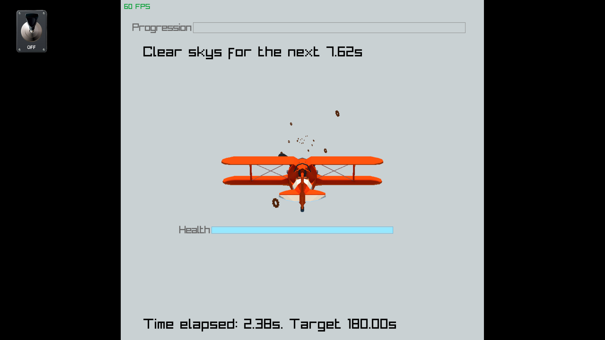

# MinneFlight

A demo showing motion control usage in video games over the air. Built in C++, raylib, and a dash of rust.

## Support

Chrome on android, and not much else. Most other platforms do not support the [Gyroscope api](https://developer.mozilla.org/en-US/docs/Web/API/Gyroscope).

## Demo

If you missed the in person demo with the controller you can try out the standalone web port.

[https://foxmoss.github.io/minnehack2026/](https://foxmoss.github.io/minnehack2026/)

Not built for everything to be on one screen but it works :P

